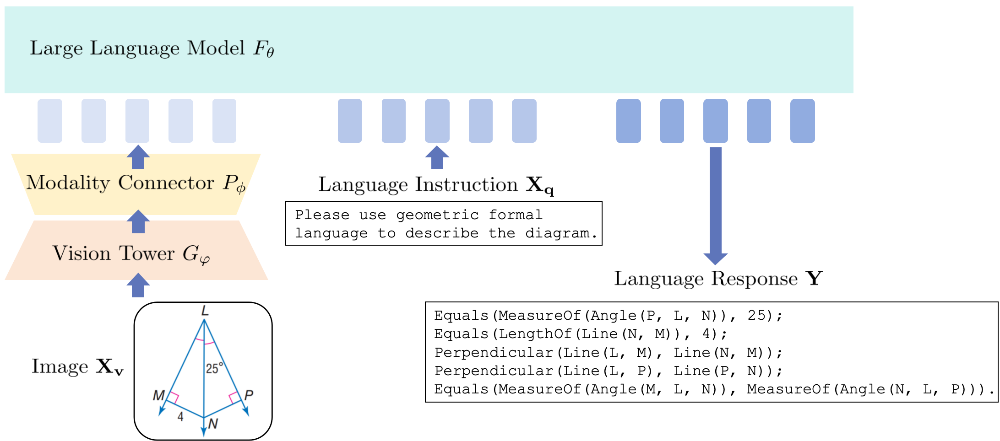

## Plane Geometry Diagram Formalization via Vision-Language Models

Code and data for the paper "Plane Geometry Diagram Formalization via Vision-Language Models".

Dataset [GDF86K](TinyLLaVA/GeoTinyLLaVA/GDF86K), Model Checkpoints [Geo-TinyLLaVA](https://huggingface.co/1509cxt/Geo-TinyLLaVA).



## Installation and Requirements

1. Clone this repository and navigate to the folder

```bash
git clone https://github.com/Geo-TinyLLaVA/Geo-TinyLLaVA.git
cd Geo-TinyLLaVA 
```

## Run Geo-TinyLLaVA 


## Train Geo-TinyLLaVA from Scrach


## Acknowledgement
The project is built on top of [InterGPS](https://github.com/lupantech/InterGPS) and [TinyLLaVA_Factory](https://github.com/TinyLLaVA/TinyLLaVA_Factory). Thanks for their wonderful works.