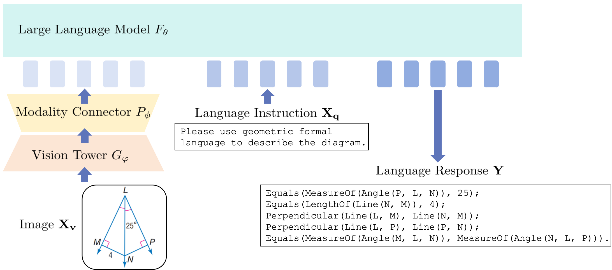

## Plane Geometry Diagram Formalization via Vision-Language Models

Code and data for the paper "Plane Geometry Diagram Formalization via Vision-Language Models".



## Installation and Requirements

1. Clone this repository and navigate to the folder

```bash
git clone https://github.com/Geo-TinyLLaVA/Geo-TinyLLaVA.git
cd Geo-TinyLLaVA 
```

## Acknowledgement
The project is built on top of [InterGPS](https://github.com/lupantech/InterGPS) and [TinyLLaVA_Factory](https://github.com/TinyLLaVA/TinyLLaVA_Factory) . Thanks for their wonderful works.